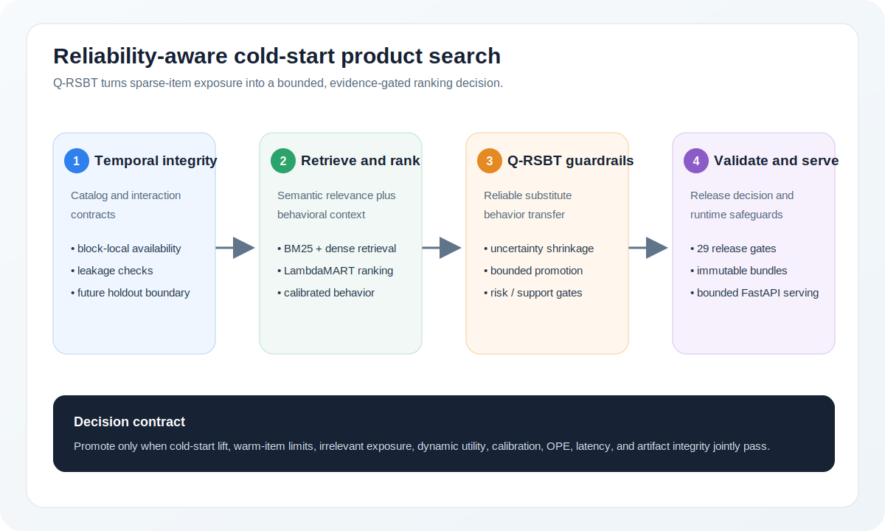
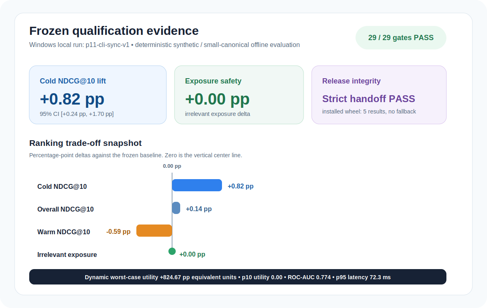

# Reliability-Aware Cold-Start Product Search v0.6.0

[](https://github.com/ReviveCoding/cold-start-product-search-reliability/actions/workflows/ci.yml?query=branch%3Amain)

An end-to-end research and production-style framework for **query-conditioned substitute behavioral transfer**, strict temporal retrieval, bounded cold-start intervention, offline experimentation validity, immutable release publication, and failure-aware serving.

## What problem it solves

New and sparse-history products can be semantically relevant but under-ranked because established products accumulate clicks and purchases. Naive age or popularity bonuses may improve exposure while promoting irrelevant products, displacing strong warm products, or creating self-reinforcing feedback.

The framework implements **Q-RSBT** (Query-Conditioned Reliable Substitute Behavioral Transfer):

1. fit retrieval statistics only on the catalog available at each scoring block;
2. retrieve and semantically rank candidates;
3. estimate cutoff-safe native and global behavioral evidence;
4. transfer behavior only from query-compatible substitutes;
5. shrink uncertain transfer toward category priors;
6. apply bounded semantic, risk, support, rank-movement, and promotion guardrails;
7. validate static quality, calibration, future stability, multi-replication feedback, OPE, serving, and release integrity before promotion.

## End-to-end architecture



The implementation combines time-aware retrieval, semantic ranking, calibrated behavioral evidence, query-conditioned substitute transfer, bounded promotion, and release-gated serving. Text-first implementation details remain in [docs/architecture.md](docs/architecture.md).

## Core capabilities

### Scientific and ML fundamentals

- fielded BM25 and dense retrieval;
- XGBoost LambdaMART-style ranking with native JSON persistence;
- calibrated logistic behavioral scoring;
- PyTorch DCN challenger with CUDA/AMP support;
- overall, cold, and warm NDCG, exposure, Brier, ECE, log loss, and paired bootstrap intervals;
- DM, IPS, SNIPS, clipped IPS, and Doubly Robust OPE;
- 5 deterministic common-random-number replications across 3 behavior scenarios.

### Reliability specialty

- global query-conditioned substitutes rather than candidate-local transfer;
- category-prior shrinkage, support, dispersion, and uncertainty;
- substitute eligibility Brier and ECE;
- semantic, compatibility, irrelevant-risk, support, freshness, and movement gates;
- future-block stability and false-warm-up analysis;
- replay and policy-sensitivity evidence.

### Production and release engineering

- strict artifact schema and config schema 6.0;
- package, Python, source-code, serving-config, catalog, feature-order, and model-fingerprint validation before deserialization;
- SHA-256 verification of the complete research release and the minimal serving closure;
- immutable release generations, atomic current pointer, rollback, publish lock, and post-failure cleanup;
- release store copies only files listed by `serving_artifact_hashes`;
- pointer-aware serving through `PRODUCT_SEARCH_RELEASE_ROOT`;
- bounded per-worker admission control and HTTP 503 overload behavior;
- real one-worker and multi-worker Uvicorn process validation;
- sanitized public model manifest endpoint;
- process-isolated pipeline and 25-shard test runner;
- deterministic source ZIP, enhanced ZIP, wheel, and normalized sdist builds;
- GitHub dependency review, full-SHA action pinning, Dependabot, and artifact-attestation workflow configuration.

## Validated smoke evidence



The default smoke profile is deterministic synthetic/small-canonical offline evidence, not production traffic or a live A/B test. The tracked result below is the frozen Windows local qualification run `p11-cli-sync-v1`.

| Evidence | Result |
|---|---:|
| Qualification status | **CONDITIONALLY QUALIFIED** |
| Final controller stage | **P14_FINALIZE PASS** |
| Release status | **LAUNCH** |
| Release gates | **29 / 29** |
| Cold NDCG@10 lift | **+0.82 pp** |
| Cold lift 95% CI | **[+0.24 pp, +1.70 pp]** |
| Overall NDCG@10 delta | **+0.14 pp** |
| Warm NDCG@10 delta | **-0.59 pp**, bounded by frozen guardrails |
| Irrelevant exposure delta | **+0.00 pp** |
| Dynamic worst-case utility delta | **+8.25** |
| Dynamic p10 utility delta | **0.00** |
| Future behavior ROC-AUC / Brier / ECE | **0.774 / 0.138 / 0.034** |
| Serving p95 latency | **72.3 ms** |
| Serving fallback count | **0** |
| Strict handoff validation | **PASS** |
| Installed-wheel smoke | **PASS: 5 results, fallback false** |

Warm-item ranking is a disclosed bounded trade-off, not a universal ranking improvement claim. The release contract accepted this configuration because overall quality, irrelevant-exposure safety, dynamic utility, calibration, OPE, serving, and artifact-integrity gates jointly passed. See [tracked machine-readable evidence](evidence/windows-local-p11-cli-sync-v1/) and [results interpretation](docs/results.md).

## Quick start

Supported runtime: Python 3.11 through 3.13.

```bash
python -m pip install --upgrade pip
python -m pip install -c constraints/validated.txt -e ".[dev]"
python scripts/run_full_pipeline.py --config configs/smoke.yaml
python scripts/run_tests.py
python scripts/integration_validation.py --config configs/smoke.yaml --skip-pipeline
python scripts/reproducibility_check.py --config configs/smoke.yaml
python scripts/run_policy_sensitivity.py --config configs/smoke.yaml
python scripts/verify_build_reproducibility.py
```

Windows uses the same Python entry points:

```powershell
py -m pip install -c constraints/validated.txt -e ".[dev]"
py scripts/run_full_pipeline.py --config configs/smoke.yaml
py scripts/run_tests.py
```

## Validated dependency contract

`pyproject.toml` defines supported compatibility ranges, while `constraints/validated.txt` pins the direct environment used to generate release evidence. CI, Docker, and documented validation commands use the constraints file. Upgrading a constrained dependency requires rerunning the full pipeline, tests, replay, sensitivity analysis, and build reproducibility checks. The core package explicitly excludes XGBoost 3.3 because the same deterministic data and seed produced a materially different release decision under that version.

## Release candidate handoff

The candidate handoff is machine-verifiable and deliberately does not claim final release qualification. After the candidate validation commands and distribution build complete, generate and validate it with:

```bash
python scripts/generate_candidate_handoff.py \
  --candidate-version 0.6.0-candidate.1 \
  --source-commit 9b590ce \
  --baseline-hashes /path/to/baseline_file_hashes.json \
  --evidence-dir /path/to/final-command-evidence \
  --release-manifest /path/to/project9_v0.6.0_RELEASE_MANIFEST.json \
  --artifact wheel=dist/cold_start_product_search_reliability-0.6.0-py3-none-any.whl \
  --artifact sdist=dist/cold_start_product_search_reliability-0.6.0.tar.gz
python scripts/validate_candidate_handoff.py --handoff release_candidate_handoff.json
```

See `docs/improvement_report.md` and `docs/known_limitations.md` for candidate evidence and the remaining E4 qualification boundary.

## Candidate handoff validation

Strict handoff validation verifies dependency manifests plus built wheel/sdist records:

```bash
python scripts/validate_candidate_handoff.py --handoff release_candidate_handoff.json
```

Source-only ZIPs intentionally exclude `dist/`. Before building wheel/sdist, use the preflight mode to validate source metadata, dependency manifests, and command evidence while reporting missing build artifacts instead of failing:

```bash
python scripts/validate_candidate_handoff.py \
  --handoff release_candidate_handoff.json \
  --allow-missing-build-artifacts
```

After running `python scripts/build_release.py --output-dir dist`, rerun strict validation without the flag.

## Immutable release operations

Publish a validated LAUNCH artifact into an immutable local release store:

```bash
python scripts/manage_release.py publish \
  --source artifacts/smoke \
  --release-root releases
```

Inspect, roll back, or recover an explicitly abandoned lock:

```bash
python scripts/manage_release.py status --release-root releases
python scripts/manage_release.py rollback --release-root releases
python scripts/manage_release.py force-unlock --release-root releases
```

Serve the generation referenced by `current.json`:

```bash
PRODUCT_SEARCH_RELEASE_ROOT=releases python scripts/serve.py
```

Publication changes the pointer atomically, but running workers do **not** hot-reload it. Use a rolling process restart after publish or rollback. Each worker loads one complete model bundle and has its own admission semaphore and process-local metrics.

## Serving controls

```text
PRODUCT_SEARCH_MAX_CONCURRENCY=8
PRODUCT_SEARCH_ADMISSION_TIMEOUT_MS=50
PRODUCT_SEARCH_VERIFY_ARTIFACTS=1
PRODUCT_SEARCH_STRICT_ENV=1
PRODUCT_SEARCH_EXPOSE_FULL_MANIFEST=0
```

Endpoints:

- `/live`: process liveness without model dependency;
- `/ready` and `/health`: loaded model readiness and generation;
- `/search` and `/batch_search`: bounded ranking APIs;
- `/metrics`: process-local counts, latency, active requests, fallback sources, and overload rejections;
- `/model_manifest`: sanitized deployment identity by default.

## Canonical data contract

```text
products.csv
queries.csv
relevance.csv
interactions.csv
```

`queries.csv` does not require an oracle target. Sparse judgments retain their actual rank positions. Public adapters fail instead of inventing event time, launch time, or propensities.

## Advanced and external paths

```bash
python -m pip install -c constraints/validated.txt -e ".[advanced]"
make advanced

python -m pip install -c constraints/validated.txt -e ".[qwen,faiss]"
```

Qwen3 and FAISS are opt-in and are not downloaded by the smoke path. A real GPU benchmark should record weight/data snapshots, CUDA and driver versions, precision, VRAM, throughput, checkpoint hash, quality, calibration, and latency.

## GitHub and supply-chain configuration

The workflows configure:

- Ubuntu Python 3.11/3.13 and Windows Python 3.11;
- sharded tests, lint, compile, clean integration, replay, and deterministic build checks;
- PR dependency review with a high-severity failure threshold;
- all third-party actions pinned to full commit SHAs;
- release-tag to package-version validation;
- wheel, sdist, and checksum build provenance attestations;
- release upload without overwriting existing assets.

Hosted Actions and attestations require an actual GitHub push/release and are not claimed as locally executed evidence.

## V5 selective-promotion closeout

A later V5 addendum tested whether fully observed synthetic action effects and recovered pre-action runtime state could justify a **personalized** rank-placement policy for cold-start promotion. The answer was no: V5-J predictive viability was **not justified**, so the source baseline remains the approved policy. No V5 final serving model, threshold, calibration, or confirmation artifact was created.

This no-go decision concerns the later personalized-promotion extension and does not re-label the existing baseline smoke-release evidence. The complete evidence chain, stability analysis, and checksum-verification instructions are in [`docs/v5_selective_promotion_closeout.md`](docs/v5_selective_promotion_closeout.md) and [`evidence/v5/`](evidence/v5/).

## Claim boundaries

This repository does not claim proprietary traffic, real launch timestamps where only first-observed time exists, causal production sales lift, a live online A/B test, executed full KuaiSearch/ESCI benchmarks, Qwen3 GPU tuning, million-item FAISS profiling, a completed GitHub-hosted CI run, Docker runtime validation, or a hosted GitHub release attestation.

See `IMPROVEMENT_AUDIT.md`, `FINAL_VALIDATION_REPORT.md`, and `PROJECT_IMPLEMENTATION_SUMMARY.md` for the full evidence trail.
